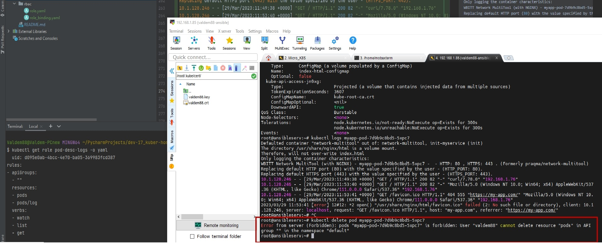

# Домашнее задание к занятию "Управление доступом" Соловьев Д.В.

### Цель задания

В тестовой среде Kubernetes необходимо предоставить ограниченный доступ пользователю.

------

### Чеклист готовности к домашнему заданию

1. Установленное k8s-решение (например, MicroK8S)
2. Установленный локальный kubectl
3. Редактор YAML-файлов с подключенным github-репозиторием

------

### Инструменты/ дополнительные материалы, которые пригодятся для выполнения задания

1. [Описание](https://kubernetes.io/docs/reference/access-authn-authz/rbac/) RBAC
2. [Пользователи и авторизация RBAC в Kubernetes](https://habr.com/ru/company/flant/blog/470503/)
3. [RBAC with Kubernetes in Minikube](https://medium.com/@HoussemDellai/rbac-with-kubernetes-in-minikube-4deed658ea7b)

------

### Задание 1. Создать конфигурацию для подключения пользователя

#### Решение

1. Создать и подписать SSL-сертификат для подключения к кластеру.

Создаем сертификаты для подключения к кластеру

```bash
root@microk8s:~# mkdir cert && cd cert
root@microk8s:~/cert# openssl genrsa -out dsolov.key 2048
root@microk8s:~/cert# openssl req -new -key dsolov.key -out dsolov.csr -subj "/CN=dsolov/O=group1"
root@microk8s:~/cert# openssl x509 -req -in dsolov.csr -CA /var/snap/microk8s/4595/certs/ca.crt -CAkey /var/snap/microk8s/4595/certs/ca.key -CAcreateserial -out dsolov.crt -days 500
Certificate request self-signature ok
subject=CN = dsolov, O = group1
```

2. Настроить конфигурационный файл kubectl для подключения

Переносим на машину с которой будем подключаться и настраиваем конфигурационный файл. Добавляем юзера, добавляем контекст и проверяем конфигурацию.
```bash
root@ansibleserv:~/.kube# kubectl config set-credentials dsolov --client-certificate=cert/dsolov.crt --client-key=cert/dsolov.key
User "dsolov" set.
root@ansibleserv:~/.kube# cd
root@ansibleserv:~# kubectl config set-context dsolov-context --cluster=microk8s-cluster --user=dsolov
Context "dsolov-context" created.
root@ansibleserv:~# kubectl config view
apiVersion: v1
clusters:
- cluster:
    certificate-authority-data: DATA+OMITTED
    server: https://192.168.1.88:16443
  name: microk8s-cluster
contexts:
- context:
    cluster: microk8s-cluster
    user: admin
  name: microk8s
- context:
    cluster: microk8s-cluster
    user: dsolov
  name: dsolov-context
current-context: microk8s
kind: Config
preferences: {}
users:
- name: admin
  user:
    token: REDACTED
- name: dsolov
  user:
    client-certificate: cert/dsolov.crt
    client-key: cert/dsolov.key
```

3. Создать Роли и все необходимые настройки для пользователя

   - [Role](rbac/role.yaml)
   - [RoleBinding](rbac/role_binding.yaml)

```bash
$ kubectl apply -f rbac/role.yaml 
role.rbac.authorization.k8s.io/pod-desc-logs created

$ kubectl apply -f rbac/role_binding.yaml 
rolebinding.rbac.authorization.k8s.io/pod-reader created
```

4. Предусмотреть права пользователя. Пользователь может просматривать логи подов и их конфигурацию (`kubectl logs pod <pod_id>`, `kubectl describe pod <pod_id>`)

для начала добавляем в роль verbs: где ["watch", "list"]

```bash
$ kubectl get role pod-desc-logs -o yaml
apiVersion: rbac.authorization.k8s.io/v1
kind: Role
metadata:
  annotations:
    kubectl.kubernetes.io/last-applied-configuration: |
      {"apiVersion":"rbac.authorization.k8s.io/v1","kind":"Role","metadata":{"annotations":{},"name":"pod-desc-logs","namespace":"default"},"rules":[{"apiGroups":[""],"resources":["pods","pods/log"],"verbs":["watch","list"]}]}
  creationTimestamp: "2023-03-29T17:37:50Z"
  name: pod-desc-logs
  namespace: default
  resourceVersion: "285619"
  uid: d095e0ab-4bcc-4e70-ba05-369983fcd387
rules:
- apiGroups:
  - ""
  resources:
  - pods
  - pods/log
  verbs:
  - watch
  - list
```

и проверяем (сейчас на сервере есть такой под - $ kubectl get pod
NAME                         READY   STATUS    RESTARTS        AGE
myapp-pod-7d9b9c8bd5-5xpc7   1/1     Running   1 (7h18m ago)   30h)

```bash
root@ansibleserv:~# kubectl config use-context dsolov-context
Switched to context "dsolov-context".
root@ansibleserv:~# kubectl describe pod myapp-pod-7d9b9c8bd5-5xpc7
Error from server (Forbidden): pods "myapp-pod-7d9b9c8bd5-5xpc7" is forbidden: User "dsolov" cannot get resource "pods" in API group "" in the namespace "default"
root@ansibleserv:~# kubectl logs myapp-pod-7d9b9c8bd5-5xpc7
Error from server (Forbidden): pods "myapp-pod-7d9b9c8bd5-5xpc7" is forbidden: User "dsolov" cannot get resource "pods" in API group "" in the namespace "default"
```
Далее я выяснил что для выполнения команд `logs` и `describe` пользователю нужно добавление в роль verbs: ["get"]

```bash
$ kubectl apply -f rbac/role.yaml 
role.rbac.authorization.k8s.io/pod-desc-logs configured

$ kubectl get role pod-desc-logs -o yaml
apiVersion: rbac.authorization.k8s.io/v1
kind: Role
metadata:
  annotations:
    kubectl.kubernetes.io/last-applied-configuration: |
      {"apiVersion":"rbac.authorization.k8s.io/v1","kind":"Role","metadata":{"annotations":{},"name":"pod-desc-logs","namespace":"default"},"rules":[{"apiGroups":[""],"resources":["pods","pods/log"],"verbs":["watch","list","get"]}]}   
  creationTimestamp: "2023-03-29T17:37:50Z"
  name: pod-desc-logs
  namespace: default
  resourceVersion: "286986"
  uid: d095e0ab-4bcc-4e70-ba05-369983fcd387
rules:
- apiGroups:
  - ""
  resources:
  - pods
  - pods/log
  verbs:
  - watch
  - list
  - get
```

Проверяем что изменилось с тестовой машины

```bash
root@ansibleserv:~# kubectl describe pod myapp-pod-7d9b9c8bd5-5xpc7
Name:             myapp-pod-7d9b9c8bd5-5xpc7
Namespace:        default
Priority:         0
Service Account:  default
Node:             microk8s/192.168.1.88
Start Time:       Tue, 28 Mar 2023 14:35:09 +0300
Labels:           app=myapp
                  pod-template-hash=7d9b9c8bd5
Annotations:      cni.projectcalico.org/containerID: b436753fc7a2ed7ca3f356dd1e1a17ca45185a03ecc30c0f9842a3b24bfe9ae2
                  cni.projectcalico.org/podIP: 10.1.128.247/32
                  cni.projectcalico.org/podIPs: 10.1.128.247/32
Status:           Running
IP:               10.1.128.247
IPs:
  IP:           10.1.128.247
Controlled By:  ReplicaSet/myapp-pod-7d9b9c8bd5
Init Containers:
  init-myservice:
    Container ID:  containerd://12f8fd4562c238f87744c46958327323187818aa270ffc266387f701b6264a09
    Image:         busybox:1.28
    Image ID:      docker.io/library/busybox@sha256:141c253bc4c3fd0a201d32dc1f493bcf3fff003b6df416dea4f41046e0f37d47
    Port:          <none>
    Host Port:     <none>
    Command:
      sh
      -c
      until nslookup myservice.$(cat /var/run/secrets/kubernetes.io/serviceaccount/namespace).svc.cluster.local; do echo waiting for myservice; sleep 2; done
    State:          Terminated
      Reason:       Completed
      Exit Code:    0
      Started:      Wed, 29 Mar 2023 14:01:08 +0300
      Finished:     Wed, 29 Mar 2023 14:02:11 +0300
    Ready:          True
    Restart Count:  1
    Environment:    <none>
    Mounts:
      /var/run/secrets/kubernetes.io/serviceaccount from kube-api-access-jn9xg (ro)
Containers:
  network-multitool:
    Container ID:   containerd://c276efc0dd6eacebeb90de63911d1698043185b0b616b35750ed1006728dd51a
    Image:          wbitt/network-multitool
    Image ID:       docker.io/wbitt/network-multitool@sha256:82a5ea955024390d6b438ce22ccc75c98b481bf00e57c13e9a9cc1458eb92652
    Ports:          80/TCP, 443/TCP
    Host Ports:     0/TCP, 0/TCP
    State:          Running
      Started:      Wed, 29 Mar 2023 14:02:11 +0300
    Last State:     Terminated
      Reason:       Unknown
      Exit Code:    255
      Started:      Tue, 28 Mar 2023 14:35:10 +0300
      Finished:     Wed, 29 Mar 2023 14:00:55 +0300
    Ready:          True
    Restart Count:  1
    Limits:
      cpu:     200m
      memory:  512Mi
    Requests:
      cpu:     100m
      memory:  256Mi
    Environment:
      HTTP_PORT:   80
      HTTPS_PORT:  443
    Mounts:
      /usr/share/nginx/html/ from nginx-index-file (rw)
      /var/run/secrets/kubernetes.io/serviceaccount from kube-api-access-jn9xg (ro)
Conditions:
  Type              Status
  Initialized       True
  Ready             True
  ContainersReady   True
  PodScheduled      True
Volumes:
  nginx-index-file:
    Type:      ConfigMap (a volume populated by a ConfigMap)
    Name:      index-html-configmap
    Optional:  false
  kube-api-access-jn9xg:
    Type:                    Projected (a volume that contains injected data from multiple sources)
    TokenExpirationSeconds:  3607
    ConfigMapName:           kube-root-ca.crt
    ConfigMapOptional:       <nil>
    DownwardAPI:             true
QoS Class:                   Burstable
Node-Selectors:              <none>
Tolerations:                 node.kubernetes.io/not-ready:NoExecute op=Exists for 300s
                             node.kubernetes.io/unreachable:NoExecute op=Exists for 300s
Events:                      <none>
root@ansibleserv:~# kubectl logs myapp-pod-7d9b9c8bd5-5xpc7
Defaulted container "network-multitool" out of: network-multitool, init-myservice (init)
The directory /usr/share/nginx/html is a volume mount.
Therefore, will not over-write index.html
Only logging the container characteristics:
WBITT Network MultiTool (with NGINX) - myapp-pod-7d9b9c8bd5-5xpc7 -  - HTTP: 80 , HTTPS: 443 . (Formerly praqma/network-multitool)
Replacing default HTTP port (80) with the value specified by the user - (HTTP_PORT: 80).
Replacing default HTTPS port (443) with the value specified by the user - (HTTPS_PORT: 443).
10.1.128.246 - - [29/Mar/2023:11:49:38 +0000] "GET / HTTP/1.1" 200 82 "-" "curl/7.78.0" "192.168.1.76"
10.1.128.246 - - [29/Mar/2023:11:53:40 +0000] "GET / HTTP/1.1" 200 82 "-" "Mozilla/5.0 (Windows NT 10.0; Win64; x64) AppleWebKit/537.36 (KHTML, like Gecko) Chrome/111.0.0.0 Safari/537.36" "192.168.1.76"
10.1.128.246 - - [29/Mar/2023:11:53:41 +0000] "GET /favicon.ico HTTP/1.1" 404 555 "https://my-app.com/" "Mozilla/5.0 (Windows NT 10.0; Win64; x64) AppleWebKit/537.36 (KHTML, like Gecko) Chrome/111.0.0.0 Safari/537.36" "192.168.1.76"
2023/03/29 11:53:41 [error] 12#12: *2 open() "/usr/share/nginx/html/favicon.ico" failed (2: No such file or directory), client: 10.1.128.246, server: localhost, request: "GET /favicon.ico HTTP/1.1", host: "my-app.com", referrer: "https://my-app.com/"
root@ansibleserv:~#
```

Команды `logs` и `describe` от уч. записи `dsolov` теперь работают. Хорошо.

Попробуем сразу после этого удалить pod.




5. Предоставить манифесты, а также скриншоты и/или вывод необходимых команд.

   - [Role](rbac/role.yaml)
   - [RoleBinding](rbac/role_binding.yaml)
   - [Config](rbac/config)

------

### Правила приема работы

1. Домашняя работа оформляется в  своем Git репозитории в файле README.md. Выполненное домашнее задание пришлите ссылкой на .md-файл в вашем репозитории.
2. Файл README.md должен содержать скриншоты вывода необходимых команд `kubectl`, а также скриншоты результатов
3. Репозиторий должен содержать тексты манифестов или ссылки на них в файле README.md